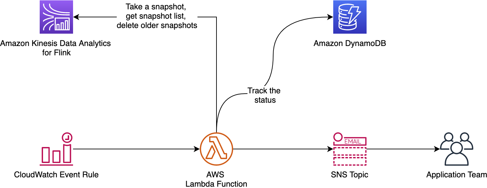

# Amazon Kinesis Data Analytics Snapshot Manager for Flink

[Amazon Kinesis Data Analytics](https://docs.aws.amazon.com/kinesisanalytics/latest/java/how-it-works.html) Snapshot Manager for Flink offers the following benefits:

   1. takes a new snapshot
   1. checks if an application has more older snapshots than required
   1. deletes older snapshots and retains most recent

This will be deployed as an [AWS Lambda](https://aws.amazon.com/lambda/) function and scheduled using [Amazon CloudWatch Events](https://docs.aws.amazon.com/AmazonCloudWatch/latest/events/WhatIsCloudWatchEvents.html) e.g. once in a day or week.

---

## Architecture



---

## Process Flow Diagram


---

## Pre-requisites

  1. Python 3.7
  1. IDE e.g. [PyCharm](https://www.jetbrains.com/pycharm/)
  1. Access to AWS Account
  1. A running Kinesis Data Analytics Flink Application

---

## AWS Service Requirements

The following AWS services are required to deploy this starter kit:

 1. 1 AWS Lambda Function
 1. 1 Amazon SNS Topic
 1. 1 Amazon DynamoDB Table
 1. 1 IAM role with 4 policies
 1. 1 AWS CloudWatch Event Rule

---

## Deployment Instructions using AWS Console

1. Create an SNS Topic and subscribe required e-mail id(s)
1. Create a DynamoDB Table
   1. Table name= ```flink_snapshot_manager_status```
   1. Primary partition key: name= ```flink_app_name```, type= String
   1. Primary sort key: name= ```snapshot_manager_run_id```, type= Number
   1. Provisioned read capacity units = 5
   1. Provisioned write capacity units = 5
1. Create following IAM policies
   1. IAM policy with name ```iam_policy_dynamodb``` using [this sample](./resources/iam_policy_dynamodb.json)
   1. IAM policy with name ```iam_policy_sns``` using [this sample](./resources/iam_policy_sns.json)
   1. IAM policy with name ```iam_policy_kinesisanalytics``` using [this sample](./resources/iam_policy_kinesisanalytics.json)
   1. IAM policy with name ```iam_policy_cloudwatch_logs``` using [this sample](./resources/iam_policy_cloudwatch_logs.json)
1. Create an IAM role with name ```kda_flink_snapshot_manager_iam_role``` and attach above policies
1. Deploy **kda_flink_session_manager** function

    1. Runtime = Python 3.7
    1. IAM role = kda_flink_snapshot_manager_iam_role
    1. Function code = Copy the contents from [amazon_kd_flink_snapshot_manager.py](./amazon_kd_flink_snapshot_manager.py)
    1. Under basic settings:
        1. Timeout = e.g. 5 minutes
        1. Memory = e.g. 128 MB
    1. Environment variable = as defined in the following table

         | Key   | Value  | Description |
         |-------| -------| ----------- |
         | region  | us-east-1 | AWS region |
         | kda_flink_app_name | ```Application Name``` | Name of the Kinesis Data Analytics Flink Application |
         | flink_snapshot_manager_table  | ```flink_snapshot_manager_status``` | Name of the DynamoDB table used to track the status |
         | primary_partition_key_name | ```flink_app_name``` | Primary partition key name |
         | primary_sort_key_name | ```snapshot_manager_run_id``` | Primary sort key name |
         | sns_topic_arn | ```SNS Topic ARN``` | SNS Topic ARN  |
         | number_of_older_snapshots_to_retain | ```30``` | The number of most recent snapshots to be retained  |
         | snapshot_creation_wait_time_seconds | ```15``` | Time gap in seconds between consecutive checks to get the status of snapshot creation  |

---

## License Summary

This sample code is made available under the MIT license. See the LICENSE file.
